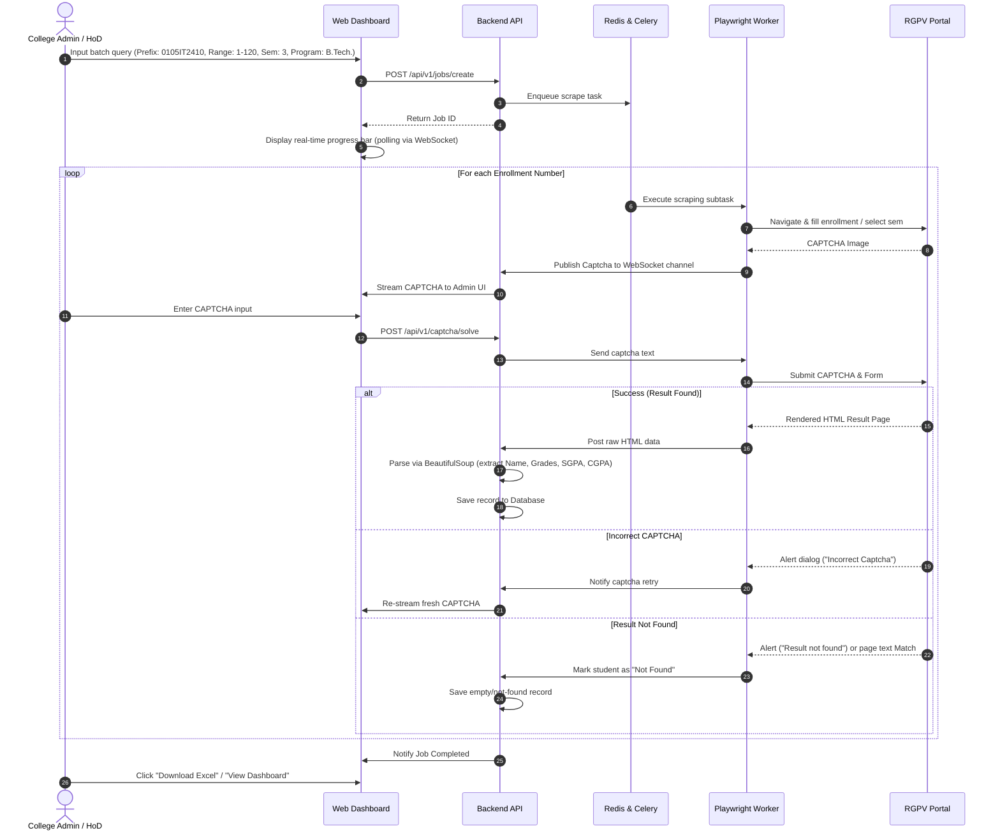

# ResultAI - RGPV Result Analytics & Dashboard Platform
## Technical Specification & Product Design Document

This document outlines the comprehensive system design, specifications, and architecture for **ResultAI**, a modern web-based results analytics platform. It extends the core capabilities of the existing RGPV CLI Result Fetcher into a scalable, multi-tenant enterprise system designed for engineering colleges affiliated with Rajiv Gandhi Proudyogiki Vishwavidyalaya (RGPV).

---

## 1. Project Overview

**ResultAI** is a premium, web-based platform that automates the retrieval, parsing, and visualization of academic results from the RGPV portal. It transforms raw, fragmented HTML results of students into structured database records and generates real-time, interactive dashboards. 

By wrapping the programmatic browser-automation script into a distributed web application, ResultAI allows institutional administrators, department heads, and faculty to monitor academic performance, spot trends, identify students at risk, and generate institutional reports with a single click.

---

## 2. Problem Statement

Rajiv Gandhi Proudyogiki Vishwavidyalaya (RGPV) publishes academic results online, but the portal suffers from significant limitations:
*   **No Bulk Retrieval:** Users can only query one enrollment number at a time, making batch or institutional analysis slow and labor-intensive.
*   **Abuse Prevention (CAPTCHA):** A dynamic captcha is served for every search request, blocking simple, headless API harvesting.
*   **Unstable Infrastructure:** The portal experiences high load and downtime during result releases, leading to query failures and timeouts.
*   **No Data Analysis:** Results are shown as raw tables. There is no facility to export data to Excel/PDF or view class-wise, subject-wise, or semester-wise performance trends.
*   **Fragmented Code Layouts:** RGPV result layouts frequently change between semesters and programs (e.g., B.Tech, B.Pharmacy, CBGS vs. CBCS vs. Grading systems), breaking conventional parsers.

The existing Python CLI script solves the parsing and Excel-generation issues for single clients but lacks scalability, accessibility for non-technical users, automated CAPTCHA queue handling, role-based access, and graphical analytics.

---

## 3. Objectives

*   **Democratic Accessibility:** Build a premium, mobile-responsive web dashboard accessible to college managers, faculty, and students without command-line dependencies.
*   **Scalable Automation:** Design a distributed scraping worker architecture using Playwright and Celery to manage high-volume concurrent scraping jobs without hitting timeouts.
*   **Intelligent Captcha Delegation:** Create a web-based CAPTCHA solver portal that aggregates pending captchas from active backend scraping threads and delegates them to logged-in users (or auto-solves via OCR).
*   **Rich Interactive Analytics:** Provide intuitive dashboards for pass/fail ratios, GPA distribution histograms, topper rankings, subject-wise fail metrics, and historical performance comparisons.
*   **Clean Data Portability:** Enable seamless Excel exports (extending the current `excel_writer.py` formatting) and detailed PDF report generation.

---

## 4. Target Users

| User Persona | Key Objective | Primary Use Case |
| :--- | :--- | :--- |
| **College Director / Dean** | Review college-wide performance and compare branches. | Tracks overall pass percentage, branch rankings, and year-on-year academic growth. |
| **Department Head (HoD)** | Analyze department performance and audit individual subjects. | Identifies which subjects have high failure rates or low average grades; generates reports for board meetings. |
| **Faculty Advisor / Class Teacher** | Track performance of a assigned batch of students. | Identifies students with backlog subjects or low SGPAs to coordinate remedial classes. |
| **System Administrator** | Manage scraping jobs, system resources, and user permissions. | Adjusts scraper delay thresholds, manages proxy pools, and monitors captcha solve rates. |

---

## 5. Complete Feature List

### 5.1. Scraper & Task Management Engine
*   **Multi-Job Scheduler:** Queue batch requests by specifying enrollment prefix (e.g., `0105IT2410`), starting and ending roll numbers, semester, and program.
*   **Smart Program/Semester Routing:** Automatically selects program type and semester using ASP.NET control inputs to match session status.
*   **Polite Scraper Concurrency:** Configurable request throttling (randomized delays between 3s-6s) and proxy rotation to prevent IP blocking.
*   **Real-time Job Tracker:** Progress bar showing `Scraped / Total` counts, current active enrollment number, success/failure rate, and estimated time of completion.

### 5.2. CAPTCHA Solving Portal
*   **In-App Captcha Stream:** A real-time web interface that uses WebSockets to stream CAPTCHA images directly from worker browsers to a user's screen.
*   **Auto-Solver Integration:** Optional hook for external OCR APIs or pre-trained CNN models to attempt immediate auto-solving before resorting to manual delegation.
*   **Multi-Solver Queue:** Allows multiple administrators to solve captchas concurrently, speeding up bulk imports (e.g., scraping 120 students in minutes).

### 5.3. Interactive Analytics & Dashboard
*   **KPI Cards:** Total Students, Pass Rate, Average SGPA, Active Backlogs, and Top Department Grade.
*   **Subject Analysis Matrix:** Highlights pass/fail percentages, grade distribution (A+, A, B, etc.), and fail lists for each subject code.
*   **Grade Histogram:** Interactive chart showing student count grouped by SGPA/CGPA ranges (e.g., <5.0, 5.0-6.0, 6.0-7.0, etc.).
*   **Branch Comparison Dashboard:** Compare branches side-by-side on average performance metrics.

### 5.4. Student Directory & Search
*   **Dynamic Directory Grid:** Search students by name or enrollment number; filter by status (Pass/Fail/Not Found), SGPA range, or specific subject backlogs.
*   **Individual Performance Profile:** A visual report card for each student, detailing subject-wise grades, historical GPA tracking, and a list of cleared vs. pending subjects.

### 5.5. Export & Reporting Hub
*   **Excel Exporter:** Downloads a structured `.xlsx` workbook styled with frozen headers, automatic column widths, thin borders, green fonts for PASS, and red fonts for FAIL (matching the format in `excel_writer.py`).
*   **PDF Report Generator:** Generates formatted PDF booklets for subject-wise analysis, branch analysis, or student transcript cards.

---

## 6. User Flow



---

## 7. Functional Requirements

### 7.1. Scraper Service Requirements
*   **Req-1.1:** The scraper must support programmatic program selection by interacting with the radio button grid on the RGPV Program Selection page.
*   **Req-1.2:** The scraper must handle ASP.NET browser dialogs (JS Alerts) dynamically, dismissing warning popups and identifying when a dialog represents a "Not Found" state versus a "Wrong Captcha" state.
*   **Req-1.3:** The scraping task must support run-time cancellation. If a user terminates a job, the browser session must close and clean up immediately.
*   **Req-1.4:** Connection timeout thresholds must be configured (default: 30 seconds for navigation, 20 seconds for selector wait) to prevent worker threads from hanging when RGPV servers are slow.

### 7.2. Parser Service Requirements
*   **Req-2.1:** The parser must extract Name, Enrollment Number, Semester, Program, SGPA, CGPA, and Result Status from ASP.NET label controls (`lblName`, `lblSGPA`, `lblcgpa`, `lblResult`).
*   **Req-2.2:** If ASP.NET labels are absent, the parser must fall back to regex pattern extraction on the page's raw body text.
*   **Req-2.3:** The subject-grade parser must dynamically read headers of the grades table to support variable column setups (such as CBGS vs. CBCS) without hardcoding subject names or positions.
*   **Req-2.4:** The parser must identify and classify failure grades. A subject grade matching `F`, `FAIL`, `AB`, `ABSENT`, or `RL` must be flagged, and the subject code added to the `fail_subjects` array.

### 7.3. REST API Requirements
*   **Req-3.1:** The API must expose endpoints to initialize, pause, resume, and cancel bulk scraping jobs.
*   **Req-3.2:** The API must serve data aggregates (Average SGPA, pass/fail rates) grouped by job, department, or semester.
*   **Req-3.3:** The API must support pagination, sorting, and multi-parameter filtering for student result tables.

### 7.4. Frontend Requirements
*   **Req-4.1:** The dashboard must display real-time analytics graphs using interactive libraries.
*   **Req-4.2:** The dashboard must provide a dedicated CAPTCHA input overlay that takes focus immediately when a captcha is streamed.

---

## 8. Non-Functional Requirements

### 8.1. Performance & Scalability
*   **Asynchronous Processing:** Long-running scraping operations must run completely out-of-process in a background task queue (Celery/Redis) to prevent HTTP connection timeouts.
*   **Scraping Throughput:** A single worker should take no more than 8–12 seconds per student record, assuming immediate CAPTCHA entry.
*   **Data Aggregation Speed:** DB queries for dashboard charts must execute in under 300ms, using indexes on enrollment prefixes, semesters, and pass/fail states.

### 8.2. Reliability & Exception Handling
*   **Transient Fault Handling:** Automatic retries (up to 3 times) for web navigation failures caused by network blips.
*   **Session Recovery:** If a scraping worker crashes mid-job, the state must be preserved in the DB, allowing the job to be resumed from the last successfully parsed roll number.

### 8.3. Usability & Accessibility
*   **Visual Aesthetics:** Elegant dark/light mode dashboard with glassmorphism panels, customized HSL color systems, and modern typography (e.g., Inter, Outfit).
*   **Responsive UI:** Dashboard grids must stack cleanly on tablets and mobile screens.

---

## 9. Database Entities & Relationships

```mermaid
erDiagram
    COLLEGE ||--o{ USER : contains
    COLLEGE ||--o{ STUDENT : enrolls
    USER ||--o{ BATCH_JOB : creates
    BATCH_JOB ||--o{ RESULT_RECORD : produces
    STUDENT ||--o{ RESULT_RECORD : has
    RESULT_RECORD ||--o{ GRADE_RECORD : details
    SUBJECT ||--o{ GRADE_RECORD : graded_in

    COLLEGE {
        int id PK
        string name
        string code UNIQUE
    }

    USER {
        int id PK
        string email UNIQUE
        string password_hash
        string role "ADMIN | FACULTY"
        int college_id FK
    }

    BATCH_JOB {
        int id PK
        string prefix
        int start_roll
        int end_roll
        string sem
        string program
        string status "PENDING | ACTIVE | PAUSED | COMPLETED | FAILED"
        int total_records
        int processed_count
        int created_by_id FK
        datetime created_at
    }

    STUDENT {
        int id PK
        string enrollment_no UNIQUE
        string name
        string program
        int college_id FK
    }

    RESULT_RECORD {
        int id PK
        int student_id FK
        int batch_job_id FK
        string sem
        float sgpa
        float cgpa
        string result_status "PASS | FAIL | UNKNOWN | NOT_FOUND"
        datetime fetched_at
    }

    SUBJECT {
        int id PK
        string code UNIQUE
        string name
    }

    GRADE_RECORD {
        int id PK
        int result_record_id FK
        int subject_id FK
        string grade
        boolean is_fail
    }
```

---

## 10. API Endpoints

### 10.1. Authentication
*   `POST /api/v1/auth/login` - Returns JWT token for users.
*   `POST /api/v1/auth/register` - Registers college administrators.

### 10.2. Job Management
*   `POST /api/v1/jobs/create` - Creates and runs a bulk scraping job.
    *   *Body:* `{"prefix": "0105IT2410", "start": 1, "end": 120, "sem": "3", "program": "B.Tech."}`
*   `GET /api/v1/jobs` - Lists all created scraping jobs.
*   `GET /api/v1/jobs/{id}` - Returns real-time progress status of a job.
*   `POST /api/v1/jobs/{id}/cancel` - Cancels an active scraping job.

### 10.3. Captcha Solver
*   `GET /api/v1/captcha/pending` - Returns next pending captcha image (Base64) for manual solving.
*   `POST /api/v1/captcha/solve` - Submits captcha answer for a specific browser session worker.
    *   *Body:* `{"task_id": "uuid-xxx-yyy", "solution": "A4B7D"}`

### 10.4. Results & Analytics
*   `GET /api/v1/analytics/overview?job_id={id}` - Dashboard stats card aggregates (Pass %, SGPA distributions).
*   `GET /api/v1/analytics/subjects?job_id={id}` - Subject performance data.
*   `GET /api/v1/results` - Filterable student list (search name, status, etc.).
*   `GET /api/v1/results/{enrollment}` - Detailed historical profiles for a student.
*   `GET /api/v1/export/excel?job_id={id}` - Generates and returns styled `.xlsx` file.

---

## 11. System Architecture

ResultAI adopts a modern microservices-inspired architecture designed to run on containerized infrastructure.

```
       +---------------------------------------------+
       |             Client Web App                  |
       |  (Vite / React / Tailwind / Recharts UI)    |
       +--------------------+------------------------+
                            | HTTP / WebSockets
                            v
       +---------------------------------------------+
       |             FastAPI Backend Gateway         |
       |  - Auth & RBAC   - DB Store   - API Routes   |
       +-------+--------------------+----------------+
               |                    |
               | Postgres DB        | Redis Message Broker & Queue
               v                    v
     +------------+        +--------------------------+
     | PostgreSQL |        |   Celery Task Workers    |
     | Database   |        |   - Playwright Scrapers  |
     +------------+        |   - Captcha Listeners    |
                           +------------+-------------+
                                        |
                                        v
                               +------------------+
                               |   RGPV Portal    |
                               +------------------+
```

### 11.1. Core Architectural Details
1.  **Frontend Single Page Application (SPA):** Built with React + TypeScript, communicating with backend APIs and subscribing to WebSockets for live crawler progress.
2.  **API Gateway (FastAPI):** Python framework handling authentication, ORM database connectivity, and serving high-frequency requests.
3.  **Task Broker (Redis):** Acts as a message broker for Celery and coordinates WebSocket channels for real-time CAPTCHA forwarding.
4.  **Distributed Workers (Celery + Playwright):** Worker nodes containing isolated chromium browser environments. These processes load the RGPV site, retrieve screenshots of captchas, wait for solutions, perform target selections, and pass raw HTML back to the database.

---

## 12. Folder Structure

```
result-ai/
├── backend/
│   ├── app/
│   │   ├── __init__.py
│   │   ├── api/                  # API router endpoints
│   │   ├── core/                 # Config, security, db connection
│   │   ├── models/               # SQLAlchemy Models
│   │   ├── schemas/              # Pydantic serialization schemas
│   │   ├── services/             # Core business logic
│   │   │   ├── parser.py         # BS4 result HTML parser
│   │   │   └── excel_writer.py   # Styled openpyxl Excel exporter
│   │   └── main.py               # FastAPI entry point
│   ├── Dockerfile
│   └── requirements.txt
├── workers/
│   ├── app/
│   │   ├── __init__.py
│   │   ├── tasks.py              # Celery background tasks
│   │   └── scraper.py            # Playwright automation classes
│   ├── Dockerfile
│   └── requirements.txt
├── frontend/
│   ├── public/
│   ├── src/
│   │   ├── assets/               # Standard CSS and images
│   │   ├── components/           # Reusable UI widgets (Charts, grids)
│   │   ├── pages/                # Page layouts (Dashboard, Jobs, Solvers)
│   │   ├── services/             # API request wrappers
│   │   ├── App.tsx
│   │   └── main.tsx
│   ├── package.json
│   ├── tailwind.config.js        # UI utility styles (if opted)
│   └── vite.config.ts            # Fast client bundler config
├── docker-compose.yml            # Multi-container local orchestration
└── README.md
```

---

## 13. UI/UX Requirements

### 13.1. Typography & Theme
*   **Primary Font:** `Outfit` (sans-serif) for clean titles and headings; `Inter` for data tables and body fonts.
*   **Sleek Dark Mode (Default):**
    *   Background: Dark slate `#0f172a` (zinc-900 / slate-900).
    *   Card Accents: Semi-transparent glassmorphism panels with thin borders (`rgba(255,255,255,0.05)`) and backdrops.
    *   Brand Colors: Violet gradient `#7c3aed` to Indigo `#4f46e5`.
    *   Success Green: Emerald `#10b981`.
    *   Fail Red: Crimson `#f43f5e`.

### 13.2. Responsive Grid Systems
*   Dashboards must utilize flex/grid containers that rearrange seamlessly from 4-column widgets on high-res monitors to single columns on smartphones.
*   Tables must support horizontal scrolling with pinned student names and enrollment fields.

### 13.3. micro-animations
*   Pulse indicators on active scraper status lines.
*   Smooth page transitions using framer-motion or standard CSS fade effects.
*   Hover transformations (slight upscale and shadow shift) on dashboard cards.

---

## 14. Pages and Components (Frontend)

### 14.1. Pages
1.  **Overview Dashboard:** High-level metrics view. Houses line charts, performance statistics, and overall passing rates.
2.  **Scraper Control Room:** Interface to start new bulk jobs, view queued tasks, monitor current scraper console logs, and pause threads.
3.  **Captcha Solve Station:** Active visual page with live captchas. A dashboard operator can leave this open to input captchas for backend workers sequentially.
4.  **Student Explorer Directory:** Searchable table list of students with query controls. Clicking a student shows their full profile.

### 14.2. Key Components
*   **MetricCard:** Dynamic card representing a number (e.g., pass rate), trend percentage, and mini-icon.
*   **ResultTable:** Advanced grid with filtering headers, status tags, and sorting options.
*   **CaptchaOverlay:** A key-locked pop-up modal requiring inputs that blocks page actions when a captcha task needs instant manual resolver attention.
*   **GradeGrid:** Reusable visual card detailing subject codes, subject names, credit hours, and grades.

---

## 15. User Stories

### Story 1: Bulk Fetch Initialization
*   **As an** Engineering Department HoD,
*   **I want to** start a bulk result fetch job by providing an enrollment number range, semester, and program,
*   **So that** I do not have to copy and paste results one-by-one.
*   *Acceptance Criteria:*
    *   Form requires valid inputs (prefix, start roll, end roll, sem, and program).
    *   Displays validation warnings if start roll >= end roll.
    *   Successfully schedules a task in the background and shows a real-time progress indicator.

### Story 2: Captcha Resolution Flow
*   **As a** System Operator,
*   **I want to** solve CAPTCHAs via a web overlay during a running scraper job,
*   **So that** the crawler can bypass RGPV's portal validation.
*   *Acceptance Criteria:*
    *   A captcha modal overlay is displayed whenever the scraper hits the check page.
    *   Submitting the CAPTCHA sends the answer immediately via WebSockets to the Playwright thread.
    *   If incorrect CAPTCHA is entered, shows a "retry" alert and refreshes the CAPTCHA block in-place.

### Story 3: Performance Analysis
*   **As a** College Director,
*   **I want to** see which subjects have the highest failure rates,
*   **So that** I can direct faculty to focus on target subject revisions.
*   *Acceptance Criteria:*
    *   Dashboard provides a sorted list of subjects based on failure percentage.
    *   Clicking a subject shows the names and roll numbers of all students who failed that subject.

---

## 16. Validation Rules

### 16.1. Input Validation (Form Fields)
*   **Enrollment Prefix:** Must match alphanumeric format (e.g., `^0105[A-Z]{2}\d{4}$` - College Code + Branch Code + Year Code).
*   **Roll Number Range:** Start roll and End roll must be positive integers between `1` and `999`. Start roll must be less than or equal to End roll.
*   **Semester Value:** Restricted to selection integers between `1` and `8`.
*   **CAPTCHA Input:** Must be alphanumeric, exactly 5 characters long (based on current RGPV captcha parameters).

### 16.2. Scraper Failures & Retries
*   If student result query displays "Incorrect Captcha", repeat loop up to 3 times before setting task state to FAIL.
*   If page returns "Result Not Found" (HTTP/HTML match), stop retrying immediately, record status as `NOT_FOUND`, and move to the next student.

---

## 17. Security Requirements

*   **Role-Based Access Control (RBAC):** Restrict scraping triggers and data exports to authenticated administrators (`FACULTY` or `ADMIN` roles). Standard students can only view search interfaces.
*   **Data Protection:** Student result pages and database records must be securely stored. No API endpoint should expose raw HTML files to unauthenticated web clients.
*   **Polite Rate Limiting:** Rate limit client scraper job requests. Establish minimum delays (minimum 3 seconds) on crawler threads to avoid causing a Denial of Service (DoS) load spikes on RGPV's servers.

---

## 18. Deployment Requirements

*   **Docker Containerization:** Separate Dockerfiles for frontend, backend, and background workers.
    ```yaml
    # docker-compose.yml services overview
    services:
      db:       # PostgreSQL 15 database
      redis:    # Redis broker for Celery and WebSockets
      backend:  # FastAPI Web Server
      worker:   # Celery worker with Playwright and Chromium dependencies installed
      frontend: # Vite development or Nginx static server
    ```
*   **Environment Variables:** Encrypted production configuration for database connection strings, CORS origins, and Redis configurations.
*   **Playwright Linux Dependencies:** Scraper Docker image must run on a Debian base image with all Playwright dependencies and Chromium system libraries pre-installed (using `playwright install-deps`).

---

## 19. Future Enhancements

*   **Convolutional Neural Network (CNN) CAPTCHA Solver:** Train a light TensorFlow or PyTorch OCR model directly on fetched RGPV Captchas to fully automate result harvesting.
*   **Automated Email/WhatsApp Notifications:** Integrate WhatsApp/Email SMS gateways to instantly alert students once their branch results are updated and parsed.
*   **Predictive Risk Modeling:** Use historic student CGPA curves to predict graduation classifications and auto-flag students at risk of missing graduation credit limits.
