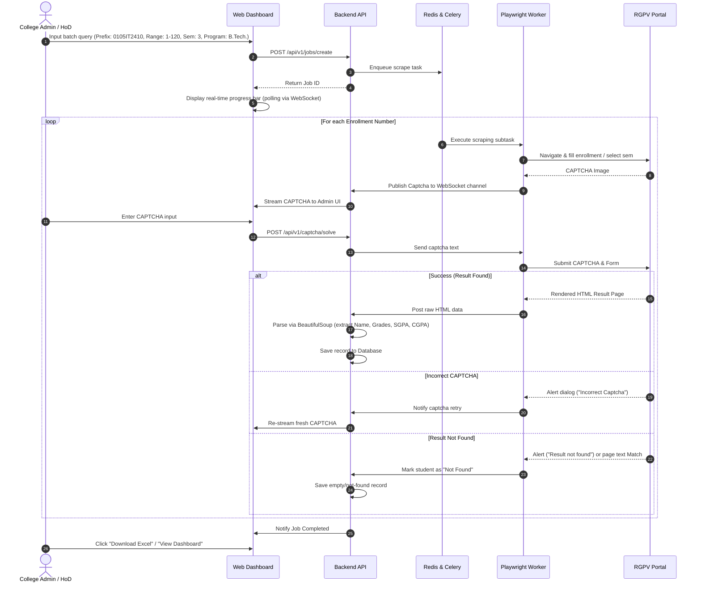

# ResultAI - RGPV Result Analytics & Dashboard Platform
## Technical Specification, Product Design & Current Implementation Status

> **Last Updated:** 2026-07-18  
> **Status:** MVP Live — Backend + Frontend Fully Functional

---

## 🔧 TECH STACK (Current Implementation)

### Backend
| Layer | Technology | Version |
|---|---|---|
| Web Framework | **FastAPI** | ≥ 0.110.0 |
| ASGI Server | **Uvicorn** | ≥ 0.28.0 |
| Browser Automation | **Playwright (Sync API)** | ≥ 1.44.0 |
| HTML Parser | **BeautifulSoup4** | ≥ 4.12.0 |
| HTML Parser Backend | **lxml** | ≥ 5.2.0 |
| Excel Generation | **openpyxl** | ≥ 3.1.0 |
| Data Handling | **pandas** | ≥ 2.2.0 |
| Real-time Comm | **WebSockets** | ≥ 12.0 |
| Language | **Python 3.x** | — |

### Frontend
| Layer | Technology | Version |
|---|---|---|
| UI Framework | **React** | ^19.2.7 |
| Build Tool | **Vite** | ^8.1.1 |
| Animations | **Framer Motion** | ^12.42.2 |
| Language | **JavaScript (JSX)** | ES Module |
| Styling | **Vanilla CSS** (Custom Design System) | — |
| Fonts | **Google Fonts** — Outfit, Inter, Fira Code | — |
| Linter | **oxlint** | ^1.71.0 |

### Runtime & Environment
| Component | Tech |
|---|---|
| OS Target | Windows (msvcrt used for keypress detection) |
| Browser | Chromium (via Playwright) |
| Python Env | venv (virtual environment) |
| Data Output | `.xlsx` Excel files in `/data` folder |
| Real-time Protocol | WebSocket (`/api/ws`) + HTTP REST |

---

## 📁 CURRENT PROJECT STRUCTURE (Actual)

```
RESULT_AI/
├── main.py                    # CLI entry point (original standalone mode)
├── requirements.txt           # Python dependencies
├── README.md                  # Setup & usage guide
├── temp.md                    # This document
├── venv/                      # Python virtual environment
├── data/                      # Output Excel files (.xlsx)
│   ├── .gitkeep
│   ├── RGPV_Result_0105IT2410_1-2.xlsx
│   └── RGPV_Result_0105IT2410_1-3.xlsx
├── automation/                # Core scraping & parsing logic
│   ├── __init__.py
│   ├── scraper.py             # Playwright browser automation
│   ├── parser.py              # BeautifulSoup HTML parser
│   └── excel_writer.py        # openpyxl Excel exporter
├── backend/                   # FastAPI web server
│   ├── __init__.py
│   └── server.py              # REST API + WebSocket server
└── frontend/                  # React Vite SPA
    ├── index.html
    ├── package.json
    ├── vite.config.js
    ├── .gitignore
    ├── .oxlintrc.json
    ├── dist/                  # Production build output
    ├── public/
    └── src/
        ├── main.jsx           # React entry point
        ├── App.jsx            # Main application component (845 lines)
        ├── App.css            # Component-level styles
        └── index.css          # Global design system CSS (913 lines)
```

---

## ✅ WHAT IS CURRENTLY IMPLEMENTED (MVP Done)

### 1. `automation/scraper.py` — Playwright Browser Automation
- **Class:** `RGPVScraper` (context manager pattern `__enter__`/`__exit__`)
- **Flow:**
  1. Opens Chromium browser (supports both headless and headful modes; headless is recommended for high OCR accuracy)
  2. Navigates to `PROGRAM_SELECT_URL` → selects program via radio buttons
  3. Fills enrollment number in `SELECTOR_ENROLLMENT_INPUT`
  4. Selects semester via `SELECTOR_SEMESTER_SELECT` and explicitly waits for the ASP.NET postback to load the new CAPTCHA image (using a client-side JavaScript validator that monitors changes to the image `src` and completeness)
  5. Automatically screenshots and solves the CAPTCHA locally using the `ddddocr` engine
  6. Normalizes the CAPTCHA prediction (converts to uppercase to handle case-ambiguities, filters out invalid non-alphanumeric outputs like Chinese characters/noise, and triggers an in-browser CAPTCHA click to refresh if invalid characters are detected)
  7. Submits the form and handles dialog/alert events safely (clearing duplicate listeners beforehand and wrapping dialog dismissal to prevent asyncio event loop crashes)
  8. If a CAPTCHA fails, handles retry loop (up to 12 auto-attempts) by re-selecting the target semester if it resets and waiting for the new CAPTCHA image to refresh
  9. Polls page content for SGPA/CGPA keywords to confirm the result has successfully loaded
  10. Returns `FetchResult(enrollment, html, error)` dataclass
- **Browser close detection:** catches Playwright-specific "Target closed" / "has been closed" signals
- **Polite delay:** random 1–2 second sleep (or 3-6s custom config) between requests to protect server load

### 2. `automation/parser.py` — BeautifulSoup HTML Parser
- **Class:** `ResultNotFound(Exception)` — raised when record absent
- **`is_not_found(page_text)`** — checks for patterns: "no record found", "invalid enrollment", "result not found", "data not available"
- **`find_result_table(soup)`** — heuristic table finder: scores tables by counting subject-code-like headers (`[A-Z]{2,4}-?\d{3,4}`)
- **`parse_result_html(html, enrollment)`** — full parser:
  - Extracts `Name` from `#lblName` ASP.NET control
  - Extracts `SGPA` from `#lblSGPA`, `CGPA` from `#lblcgpa`, `Result` from `#lblResult`
  - Fallback: regex SGPA/CGPA extraction on raw page text
  - Subject/Grade extraction: scans all 4-column table rows for subject code pattern
  - Fallback: uses `find_result_table` for alternate layout
  - Fail subjects: grades matching `F`, `FAIL`, `AB`, `ABSENT`, `RL`
  - Result determination: PASS / FAIL / UNKNOWN

### 3. `automation/excel_writer.py` — openpyxl Excel Generator
- Generates `.xlsx` with columns: `S.NO | ENROLLMENT | NAME | [subjects] | RESULT | SGPA | CGPA`
- Dynamic subject columns (first-seen order across all records)
- Header styling: bold + blue fill (`DDEBF7`) + thin borders + center alignment
- RESULT cell: green font (`008000`) for PASS, red font (`FF0000`) for FAIL
- FAIL display: shows `"Fail in IT301, ES302"` instead of just FAIL
- Auto-fit column widths based on content
- Frozen header row (`A2`)

### 4. `backend/server.py` — FastAPI Server (398 lines)
- **WebSocket Manager:** `ConnectionManager` class — manages active WS connections, broadcasts JSON messages
- **Custom stdout redirect:** `WebLogger(io.TextIOBase)` — captures `print()` output, buffers lines, sends to `update_queue` for real-time WebSocket streaming
- **`ScrapeJobRunner` class:**
  - Runs scraping in a background `threading.Thread`
  - Tracks: `status`, `total`, `processed`, `pass_count`, `fail_count`, `not_found_count`, `error_count`, `current_enrollment`, `records[]`, `logs[]`
  - `cancel()` method — forces browser closure, sets status to `cancelled`
  - `notify_progress()` — pushes status dict to `update_queue`
  - Log capping: keeps last 500 log lines in memory
- **REST API Endpoints:**
  - `POST /api/scrape/start` — starts new scraping job (validates no active job already running)
  - `POST /api/scrape/cancel` — cancels active job
  - `GET /api/scrape/status` — returns current job status dict
  - `GET /api/scrape/download?path=...` — FileResponse for Excel download (validates `.xlsx` extension, looks in `/data`)
- **WebSocket Endpoint:** `GET /api/ws` — sends initial status on connect, then keeps connection alive
- **Background broadcast loop:** `broadcast_updates()` coroutine — polls `update_queue` every 150ms, broadcasts to all WS clients
- **Static file serving:** mounts `frontend/dist` at root `/` if built
- **CORS:** all origins allowed (`*`) for dev compatibility
- **Global lock:** `runner_lock` (threading.Lock) prevents concurrent jobs

### 5. `frontend/src/App.jsx` — React SPA (845 lines)
- **Dynamic endpoint detection:** Checks `window.location.port === '5173'` (Vite dev) vs production; sets `API_BASE` and `WS_URL` accordingly
- **State management:** `useState` hooks for form fields (prefix, start, end, pad, sem, program), job state, selected record modal
- **WebSocket connection:**
  - Auto-reconnects on disconnect (2-second retry delay)
  - Handles `{type: "status", data: {...}}` messages → `mergeStatus()`
  - Handles `{type: "log", message: "..."}` messages → appends to logs array, caps at 500
- **HTTP polling:** Fetches `/api/scrape/status` on load for state recovery
- **`mergeStatus()`:** Safe state merger with `??` fallback to prevent undefined crashes
- **UI Sections:**
  1. **Header** — Logo (gradient "R" icon), animated via Framer Motion, dark/light theme toggle, job status badge with pulse animation
  2. **Sidebar (Control Panel)** — Form with Enrollment Prefix, Start Roll, End Roll, Padding, Semester (1–8 dropdown), Program (B.Tech/B.E/B.Pharmacy/M.Tech/MCA/MBA), Start/Cancel buttons
  3. **Metric Cards Row** — 5 cards: Processed, Passed, Failed, Not Found, Errors (each with custom accent color, icon, top border)
  4. **Analytics Section** (visible when records > 0):
     - SGPA Distribution Bar Chart: 6 ranges (`< 5.0`, `5.0-6.0`, `6.0-7.0`, `7.0-8.0`, `8.0-9.0`, `> 9.0`), color-coded bars
     - Circular Pass Rate Gauge: SVG circle with stroke-dashoffset animation, purple gradient
  5. **Terminal Logger** — macOS-style dots (red/yellow/green), dark viewport, color-coded logs (green=system commands, red=errors, orange=warnings, cyan=scraper messages), line numbers, auto-scroll
  6. **Student Records Table** — Enrollment, Name, Result badge (PASS/FAIL/Not Found), SGPA, CGPA, "View Grades" button
  7. **Student Detail Modal** — Framer Motion animated overlay with subject-code: grade grid, fail grades highlighted
- **CAPTCHA notice banner:** Shown during active runs, warning about browser window and CAPTCHA

### 6. `frontend/src/index.css` — Design System (913 lines)
- **Color palette:** Deep dark slate (`#020817` bg, `#0F172A` sidebar, `#111827` cards)
- **CSS Custom Properties:** `--primary` (`#7C3AED`), `--success` (`#22C55E`), `--danger` (`#EF4444`), `--warning` (`#F59E0B`)
- **Light theme:** Full set of overrides via `body.light-theme` class
- **Glassmorphism panels:** `.glass-panel` with backdrop blur
- **Grid overlay:** Blueprint-style subtle grid lines
- **Ambient blobs:** `body::before/::after` radial gradient blobs
- **Typography:** Outfit (headings) + Inter (body) + Fira Code (terminal)
- **Metric cards:** Top border accent using `::before` pseudo-element + CSS custom properties
- **Charts:** Bar chart with tooltip on hover, circular SVG progress gauge
- **Terminal viewport:** Dark `#020617` bg, monospace font, inset shadow
- **Responsive breakpoints:** `1024px` (sidebar stacks), `768px` (charts stack)
- **Custom scrollbar** styling

### 7. `main.py` — CLI Entry Point (105 lines)
- `argparse` based CLI: `--prefix`, `--start`, `--end`, `--pad`, `--sem`, `--program`, `--headless`
- Orchestration loop: builds enrollment numbers, calls scraper, calls parser, accumulates records
- Browser close detection in CLI mode
- Saves to `data/RGPV_Result_{prefix}_{start}-{end}.xlsx`
- Prints summary: Total / Pass / Fail / Not Found / Errors

---

## 🔌 API Reference (Implemented)

| Method | Endpoint | Description |
|---|---|---|
| `POST` | `/api/scrape/start` | Start bulk scraping job |
| `POST` | `/api/scrape/cancel` | Cancel running job |
| `GET` | `/api/scrape/status` | Get current job status dict |
| `GET` | `/api/scrape/download?path=...` | Download Excel file |
| `WS` | `/api/ws` | WebSocket for real-time updates |
| `GET` | `/docs` | Auto-generated FastAPI Swagger UI |

### Request Body — `/api/scrape/start`
```json
{
  "prefix": "0105IT2410",
  "start": 1,
  "end": 20,
  "pad": 2,
  "sem": "3",
  "program": "B.Tech."
}
```

### Status Response Schema
```json
{
  "status": "running | idle | completed | cancelled | failed",
  "total": 20,
  "processed": 5,
  "pass_count": 3,
  "fail_count": 2,
  "not_found_count": 0,
  "error_count": 0,
  "current_enrollment": "0105IT241005",
  "excel_file_path": "data/RGPV_Result_0105IT2410_1-20.xlsx",
  "records": [...],
  "logs": [...]
}
```

### WebSocket Message Types
```json
// Real-time log line
{ "type": "log", "message": "[Scraper] Fetching 0105IT241005..." }

// Full status update
{ "type": "status", "data": { ...status_dict } }
```

---

## 🚀 HOW TO RUN

### Backend (FastAPI Server)
```powershell
# From project root
venv\Scripts\python -m uvicorn backend.server:app --reload --port 8000
```

### Frontend (Vite Dev Server)
```powershell
cd frontend
npm install
npm run dev
# Runs at http://localhost:5173
```

### CLI Mode (Standalone)
```powershell
venv\Scripts\python main.py --prefix 0105IT2410 --start 1 --end 20 --pad 2 --sem 3
```

### Production Build (Static Serving)
```powershell
cd frontend
npm run build
# Then backend serves frontend/dist/ at http://localhost:8000
venv\Scripts\python backend\server.py
```

---

## ⚠️ KNOWN LIMITATIONS & NOTES

1. **Windows Only:** `msvcrt` module (used for terminal keypress detection) is Windows-specific. Linux/Mac would need alternative (e.g., `termios`).
2. **Single Job at a Time:** Global `active_runner` variable + `runner_lock` — only one scraping job can run simultaneously.
3. **In-Memory State:** Job state, records, and logs are all in-memory (`ScrapeJobRunner` object). No database persistence. Server restart = data lost.
4. **No Authentication:** All API endpoints are open, no JWT/auth system.
5. **CAPTCHA Autoresolution:** CAPTCHAs are fully automated via local `ddddocr` integration. Running in `--headless` mode is highly recommended because headful mode captures OS high-DPI scaling artifacts, which lowers OCR recognition rates.
6. **Selectors May Break:** RGPV HTML selectors (`#ctl00_ContentPlaceHolder1_...`) are hardcoded. May change when RGPV updates their portal.
7. **Log Cap:** Both server-side (`active_runner.logs`) and client-side logs capped at 500 entries.
8. **No Celery/Redis:** Task queue is just a Python `threading.Thread` + `queue.Queue`. Not distributed.

---

## 🗺️ PLANNED FUTURE ENHANCEMENTS (Not Yet Implemented)

### Phase 2 — Persistence & Auth
- [ ] SQLite or PostgreSQL database (SQLAlchemy ORM)
- [ ] JWT Authentication (login/register for admins)
- [ ] Job history — persist completed jobs to DB, list previous runs
- [ ] Student directory — searchable, filterable table with DB-backed queries

### Phase 3 — Distributed Architecture
- [ ] Celery + Redis task queue for true background processing
- [ ] Multiple concurrent scraping workers
- [ ] Web-based CAPTCHA solver portal (stream CAPTCHA image to browser UI via WebSocket)
- [ ] Proxy rotation support

### Phase 4 — Advanced Analytics
- [ ] Subject-wise fail rate table (sorted by highest failure %)
- [ ] Branch comparison dashboard
- [ ] CGPA trend tracking (semester-wise history per student)
- [ ] PDF report generation

### Phase 5 — Automation
- [ ] CNN/OCR-based CAPTCHA auto-solver (TensorFlow/PyTorch)
- [ ] Email/WhatsApp notification on job completion
- [ ] Predictive CGPA risk modeling

### Phase 6 — DevOps
- [ ] Docker containerization (separate containers for backend + worker + frontend)
- [ ] `docker-compose.yml` multi-service orchestration
- [ ] CI/CD pipeline

---

## 1. Project Overview

**ResultAI** is a premium, web-based platform that automates the retrieval, parsing, and visualization of academic results from the RGPV portal. It transforms raw, fragmented HTML results of students into structured database records and generates real-time, interactive dashboards. 

By wrapping the programmatic browser-automation script into a distributed web application, ResultAI allows institutional administrators, department heads, and faculty to monitor academic performance, spot trends, identify students at risk, and generate institutional reports with a single click.

---

## 2. Problem Statement

Rajiv Gandhi Proudyogiki Vishwavidyalaya (RGPV) publishes academic results online, but the portal suffers from significant limitations:
*   **No Bulk Retrieval:** Users can only query one enrollment number at a time, making batch or institutional analysis slow and labor-intensive.
*   **Abuse Prevention (CAPTCHA):** A dynamic captcha is served for every search request, blocking simple, headless API harvesting.
*   **Unstable Infrastructure:** The portal experiences high load and downtime during result releases, leading to query failures and timeouts.
*   **No Data Analysis:** Results are shown as raw tables. There is no facility to export data to Excel/PDF or view class-wise, subject-wise, or semester-wise performance trends.
*   **Fragmented Code Layouts:** RGPV result layouts frequently change between semesters and programs (e.g., B.Tech, B.Pharmacy, CBGS vs. CBCS vs. Grading systems), breaking conventional parsers.

The existing Python CLI script solves the parsing and Excel-generation issues for single clients but lacks scalability, accessibility for non-technical users, automated CAPTCHA queue handling, role-based access, and graphical analytics.

---

## 3. Objectives

*   **Democratic Accessibility:** Build a premium, mobile-responsive web dashboard accessible to college managers, faculty, and students without command-line dependencies.
*   **Scalable Automation:** Design a distributed scraping worker architecture using Playwright and Celery to manage high-volume concurrent scraping jobs without hitting timeouts.
*   **Intelligent Captcha Delegation:** Create a web-based CAPTCHA solver portal that aggregates pending captchas from active backend scraping threads and delegates them to logged-in users (or auto-solves via OCR).
*   **Rich Interactive Analytics:** Provide intuitive dashboards for pass/fail ratios, GPA distribution histograms, topper rankings, subject-wise fail metrics, and historical performance comparisons.
*   **Clean Data Portability:** Enable seamless Excel exports (extending the current `excel_writer.py` formatting) and detailed PDF report generation.

---

## 4. Target Users

| User Persona | Key Objective | Primary Use Case |
| :--- | :--- | :--- |
| **College Director / Dean** | Review college-wide performance and compare branches. | Tracks overall pass percentage, branch rankings, and year-on-year academic growth. |
| **Department Head (HoD)** | Analyze department performance and audit individual subjects. | Identifies which subjects have high failure rates or low average grades; generates reports for board meetings. |
| **Faculty Advisor / Class Teacher** | Track performance of a assigned batch of students. | Identifies students with backlog subjects or low SGPAs to coordinate remedial classes. |
| **System Administrator** | Manage scraping jobs, system resources, and user permissions. | Adjusts scraper delay thresholds, manages proxy pools, and monitors captcha solve rates. |

---

## 5. Complete Feature List

### 5.1. Scraper & Task Management Engine
*   **Multi-Job Scheduler:** Queue batch requests by specifying enrollment prefix (e.g., `0105IT2410`), starting and ending roll numbers, semester, and program.
*   **Smart Program/Semester Routing:** Automatically selects program type and semester using ASP.NET control inputs to match session status.
*   **Polite Scraper Concurrency:** Configurable request throttling (randomized delays between 3s-6s) and proxy rotation to prevent IP blocking.
*   **Real-time Job Tracker:** Progress bar showing `Scraped / Total` counts, current active enrollment number, success/failure rate, and estimated time of completion.

### 5.2. CAPTCHA Solving Portal
*   **In-App Captcha Stream:** A real-time web interface that uses WebSockets to stream CAPTCHA images directly from worker browsers to a user's screen.
*   **Auto-Solver Integration:** Optional hook for external OCR APIs or pre-trained CNN models to attempt immediate auto-solving before resorting to manual delegation.
*   **Multi-Solver Queue:** Allows multiple administrators to solve captchas concurrently, speeding up bulk imports (e.g., scraping 120 students in minutes).

### 5.3. Interactive Analytics & Dashboard
*   **KPI Cards:** Total Students, Pass Rate, Average SGPA, Active Backlogs, and Top Department Grade.
*   **Subject Analysis Matrix:** Highlights pass/fail percentages, grade distribution (A+, A, B, etc.), and fail lists for each subject code.
*   **Grade Histogram:** Interactive chart showing student count grouped by SGPA/CGPA ranges (e.g., <5.0, 5.0-6.0, 6.0-7.0, etc.).
*   **Branch Comparison Dashboard:** Compare branches side-by-side on average performance metrics.

### 5.4. Student Directory & Search
*   **Dynamic Directory Grid:** Search students by name or enrollment number; filter by status (Pass/Fail/Not Found), SGPA range, or specific subject backlogs.
*   **Individual Performance Profile:** A visual report card for each student, detailing subject-wise grades, historical GPA tracking, and a list of cleared vs. pending subjects.

### 5.5. Export & Reporting Hub
*   **Excel Exporter:** Downloads a structured `.xlsx` workbook styled with frozen headers, automatic column widths, thin borders, green fonts for PASS, and red fonts for FAIL (matching the format in `excel_writer.py`).
*   **PDF Report Generator:** Generates formatted PDF booklets for subject-wise analysis, branch analysis, or student transcript cards.

---

## 6. User Flow



---

## 7. Functional Requirements

### 7.1. Scraper Service Requirements
*   **Req-1.1:** The scraper must support programmatic program selection by interacting with the radio button grid on the RGPV Program Selection page.
*   **Req-1.2:** The scraper must handle ASP.NET browser dialogs (JS Alerts) dynamically, dismissing warning popups and identifying when a dialog represents a "Not Found" state versus a "Wrong Captcha" state.
*   **Req-1.3:** The scraping task must support run-time cancellation. If a user terminates a job, the browser session must close and clean up immediately.
*   **Req-1.4:** Connection timeout thresholds must be configured (default: 30 seconds for navigation, 20 seconds for selector wait) to prevent worker threads from hanging when RGPV servers are slow.

### 7.2. Parser Service Requirements
*   **Req-2.1:** The parser must extract Name, Enrollment Number, Semester, Program, SGPA, CGPA, and Result Status from ASP.NET label controls (`lblName`, `lblSGPA`, `lblcgpa`, `lblResult`).
*   **Req-2.2:** If ASP.NET labels are absent, the parser must fall back to regex pattern extraction on the page's raw body text.
*   **Req-2.3:** The subject-grade parser must dynamically read headers of the grades table to support variable column setups (such as CBGS vs. CBCS) without hardcoding subject names or positions.
*   **Req-2.4:** The parser must identify and classify failure grades. A subject grade matching `F`, `FAIL`, `AB`, `ABSENT`, or `RL` must be flagged, and the subject code added to the `fail_subjects` array.

### 7.3. REST API Requirements
*   **Req-3.1:** The API must expose endpoints to initialize, pause, resume, and cancel bulk scraping jobs.
*   **Req-3.2:** The API must serve data aggregates (Average SGPA, pass/fail rates) grouped by job, department, or semester.
*   **Req-3.3:** The API must support pagination, sorting, and multi-parameter filtering for student result tables.

### 7.4. Frontend Requirements
*   **Req-4.1:** The dashboard must display real-time analytics graphs using interactive libraries.
*   **Req-4.2:** The dashboard must provide a dedicated CAPTCHA input overlay that takes focus immediately when a captcha is streamed.

---

## 8. Non-Functional Requirements

### 8.1. Performance & Scalability
*   **Asynchronous Processing:** Long-running scraping operations must run completely out-of-process in a background task queue (Celery/Redis) to prevent HTTP connection timeouts.
*   **Scraping Throughput:** A single worker should take no more than 8–12 seconds per student record, assuming immediate CAPTCHA entry.
*   **Data Aggregation Speed:** DB queries for dashboard charts must execute in under 300ms, using indexes on enrollment prefixes, semesters, and pass/fail states.

### 8.2. Reliability & Exception Handling
*   **Transient Fault Handling:** Automatic retries (up to 3 times) for web navigation failures caused by network blips.
*   **Session Recovery:** If a scraping worker crashes mid-job, the state must be preserved in the DB, allowing the job to be resumed from the last successfully parsed roll number.

### 8.3. Usability & Accessibility
*   **Visual Aesthetics:** Elegant dark/light mode dashboard with glassmorphism panels, customized HSL color systems, and modern typography (e.g., Inter, Outfit).
*   **Responsive UI:** Dashboard grids must stack cleanly on tablets and mobile screens.

---

## 9. Database Entities & Relationships

```mermaid
erDiagram
    COLLEGE ||--o{ USER : contains
    COLLEGE ||--o{ STUDENT : enrolls
    USER ||--o{ BATCH_JOB : creates
    BATCH_JOB ||--o{ RESULT_RECORD : produces
    STUDENT ||--o{ RESULT_RECORD : has
    RESULT_RECORD ||--o{ GRADE_RECORD : details
    SUBJECT ||--o{ GRADE_RECORD : graded_in

    COLLEGE {
        int id PK
        string name
        string code UNIQUE
    }

    USER {
        int id PK
        string email UNIQUE
        string password_hash
        string role "ADMIN | FACULTY"
        int college_id FK
    }

    BATCH_JOB {
        int id PK
        string prefix
        int start_roll
        int end_roll
        string sem
        string program
        string status "PENDING | ACTIVE | PAUSED | COMPLETED | FAILED"
        int total_records
        int processed_count
        int created_by_id FK
        datetime created_at
    }

    STUDENT {
        int id PK
        string enrollment_no UNIQUE
        string name
        string program
        int college_id FK
    }

    RESULT_RECORD {
        int id PK
        int student_id FK
        int batch_job_id FK
        string sem
        float sgpa
        float cgpa
        string result_status "PASS | FAIL | UNKNOWN | NOT_FOUND"
        datetime fetched_at
    }

    SUBJECT {
        int id PK
        string code UNIQUE
        string name
    }

    GRADE_RECORD {
        int id PK
        int result_record_id FK
        int subject_id FK
        string grade
        boolean is_fail
    }
```

---

## 10. API Endpoints

### 10.1. Authentication
*   `POST /api/v1/auth/login` - Returns JWT token for users.
*   `POST /api/v1/auth/register` - Registers college administrators.

### 10.2. Job Management
*   `POST /api/v1/jobs/create` - Creates and runs a bulk scraping job.
    *   *Body:* `{"prefix": "0105IT2410", "start": 1, "end": 120, "sem": "3", "program": "B.Tech."}`
*   `GET /api/v1/jobs` - Lists all created scraping jobs.
*   `GET /api/v1/jobs/{id}` - Returns real-time progress status of a job.
*   `POST /api/v1/jobs/{id}/cancel` - Cancels an active scraping job.

### 10.3. Captcha Solver
*   `GET /api/v1/captcha/pending` - Returns next pending captcha image (Base64) for manual solving.
*   `POST /api/v1/captcha/solve` - Submits captcha answer for a specific browser session worker.
    *   *Body:* `{"task_id": "uuid-xxx-yyy", "solution": "A4B7D"}`

### 10.4. Results & Analytics
*   `GET /api/v1/analytics/overview?job_id={id}` - Dashboard stats card aggregates (Pass %, SGPA distributions).
*   `GET /api/v1/analytics/subjects?job_id={id}` - Subject performance data.
*   `GET /api/v1/results` - Filterable student list (search name, status, etc.).
*   `GET /api/v1/results/{enrollment}` - Detailed historical profiles for a student.
*   `GET /api/v1/export/excel?job_id={id}` - Generates and returns styled `.xlsx` file.

---

## 11. System Architecture

ResultAI adopts a modern microservices-inspired architecture designed to run on containerized infrastructure.

```
       +---------------------------------------------+
       |             Client Web App                  |
       |  (Vite / React / Framer Motion / CSS)        |
       +--------------------+------------------------+
                            | HTTP / WebSockets
                            v
       +---------------------------------------------+
       |             FastAPI Backend Gateway         |
       |  - Auth & RBAC   - DB Store   - API Routes   |
       +-------+--------------------+----------------+
               |                    |
               | Postgres DB        | Redis Message Broker & Queue
               v                    v
     +------------+        +--------------------------+
     | PostgreSQL |        |   Celery Task Workers    |
     | Database   |        |   - Playwright Scrapers  |
     +------------+        |   - Captcha Listeners    |
                           +------------+-------------+
                                        |
                                        v
                               +------------------+
                               |   RGPV Portal    |
                               +------------------+
```

---

## 12. UI/UX Requirements

### 12.1. Typography & Theme
*   **Primary Font:** `Outfit` (sans-serif) for clean titles and headings; `Inter` for data tables and body fonts; `Fira Code` for terminal output.
*   **Sleek Dark Mode (Default):**
    *   Background: Dark slate `#020817` (deepest bg), `#0F172A` (sidebar).
    *   Card Accents: Semi-transparent glassmorphism panels with thin borders and inset shadows.
    *   Brand Colors: Violet gradient `#7C3AED` to Indigo `#4F46E5`.
    *   Success Green: Emerald `#22C55E`.
    *   Fail Red: Crimson `#EF4444`.
*   **Light Mode:** Full alternate palette via `body.light-theme` CSS class, persisted in `localStorage`.

### 12.2. Responsive Grid Systems
*   Dashboard uses CSS Grid: `340px sidebar + 1fr main` → stacks at `1024px`.
*   Analytics charts grid (`1.8fr + 1fr`) → stacks at `768px`.
*   Metric cards: `repeat(auto-fit, minmax(130px, 1fr))`.

### 12.3. Micro-animations (All via Framer Motion)
*   Header, sidebar, main panel: fade-in + slide on mount.
*   Metric cards: staggered fade-in.
*   Circular gauge: `stroke-dashoffset` CSS transition.
*   Bar chart: height transition on mount.
*   Modal: scale + opacity spring animation on enter/exit.
*   Status dot: CSS `pulse` keyframe animation when running.
*   Buttons: `whileHover` scale + `whileTap` shrink.

---

## 13. Security Requirements

*   **Role-Based Access Control (RBAC):** Restrict scraping triggers and data exports to authenticated administrators (`FACULTY` or `ADMIN` roles). Standard students can only view search interfaces.
*   **Data Protection:** Student result pages and database records must be securely stored. No API endpoint should expose raw HTML files to unauthenticated web clients.
*   **Polite Rate Limiting:** Rate limit client scraper job requests. Establish minimum delays (minimum 3 seconds) on crawler threads to avoid causing a Denial of Service (DoS) load spikes on RGPV's servers.

---

## 14. Deployment Requirements

*   **Docker Containerization:** Separate Dockerfiles for frontend, backend, and background workers.
    ```yaml
    # docker-compose.yml services overview
    services:
      db:       # PostgreSQL 15 database
      redis:    # Redis broker for Celery and WebSockets
      backend:  # FastAPI Web Server
      worker:   # Celery worker with Playwright and Chromium dependencies installed
      frontend: # Vite development or Nginx static server
    ```
*   **Environment Variables:** Encrypted production configuration for database connection strings, CORS origins, and Redis configurations.
*   **Playwright Linux Dependencies:** Scraper Docker image must run on a Debian base image with all Playwright dependencies and Chromium system libraries pre-installed (using `playwright install-deps`).

---

## 15. Future Enhancements

*   **Convolutional Neural Network (CNN) CAPTCHA Solver:** Train a light TensorFlow or PyTorch OCR model directly on fetched RGPV Captchas to fully automate result harvesting.
*   **Automated Email/WhatsApp Notifications:** Integrate WhatsApp/Email SMS gateways to instantly alert students once their branch results are updated and parsed.
*   **Predictive Risk Modeling:** Use historic student CGPA curves to predict graduation classifications and auto-flag students at risk of missing graduation credit limits.
